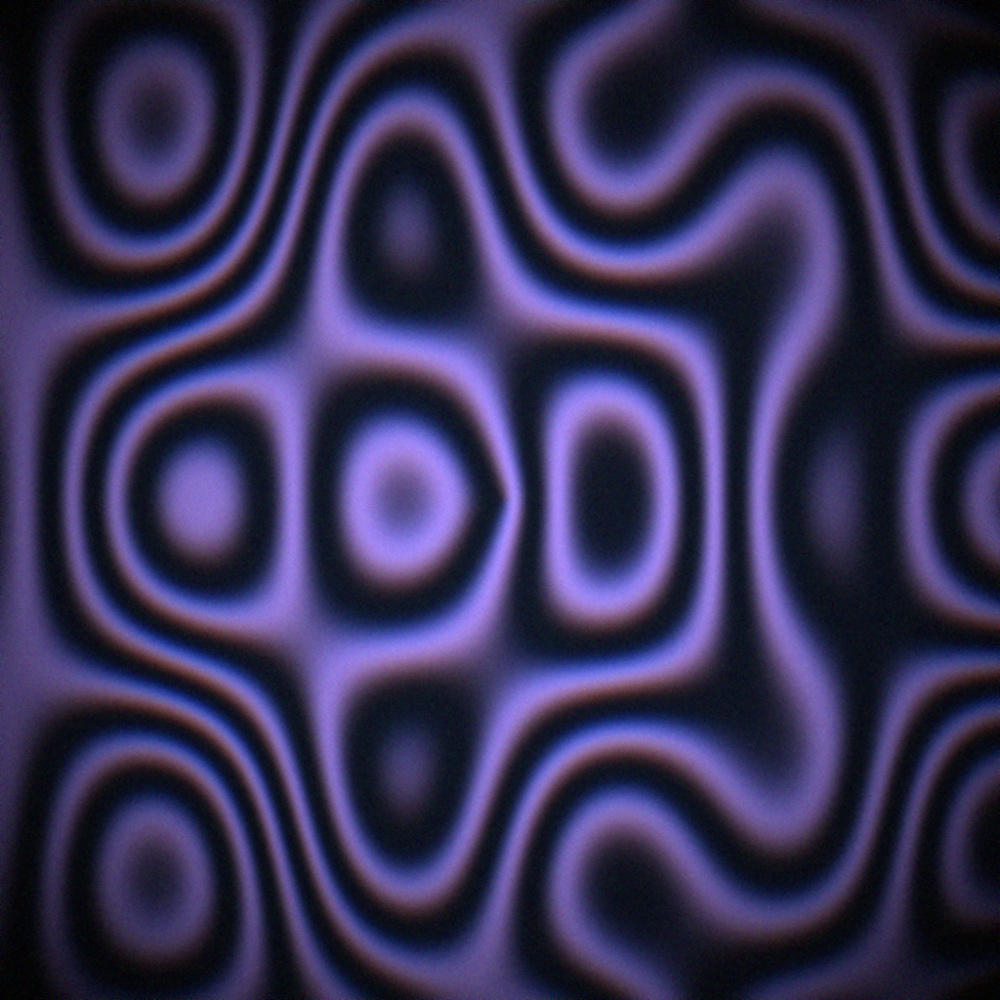
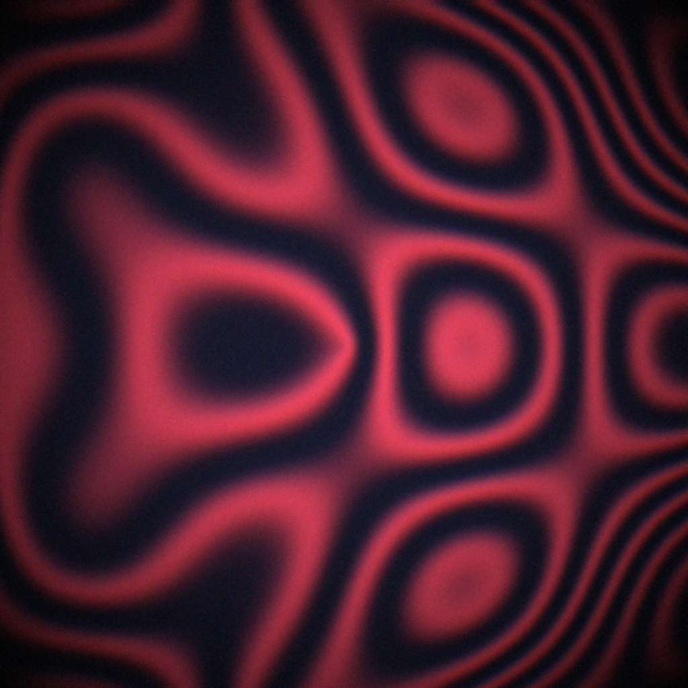
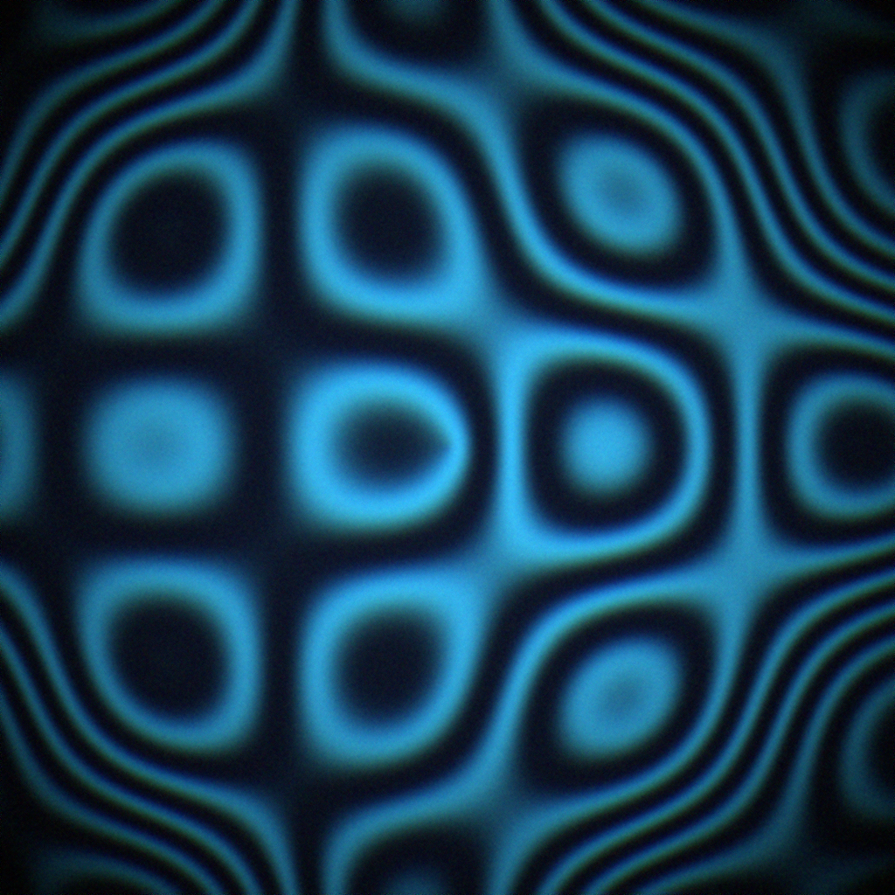

# 🧬 InterWave: Procedural Avatar Generator

[](https://www.python.org/downloads/)
[](https://opensource.org/licenses/MIT)

**InterWave** — это легковесный инструмент на Python для генерации уникальных, математически выверенных аватарок на основе никнейма. Каждое изображение создается детерминированно: один и тот же входной текст всегда генерирует один и тот же неповторимый узор.

## 🎨 Галерея примеров

Ниже представлены примеры генерации для различных никнеймов. Каждый узор уникален и зависит от хеш-суммы введенного текста.

<p align="center">
  
  
  
</p>

## ✨ Особенности

* **Алгоритмическая уникальность**: Использует интерференцию волн и функции синуса/косинуса для создания органических форм.
* **Высокая производительность**: Благодаря векторизации через **NumPy**, генерация в разрешении 1024x1024 происходит мгновенно.
* **Постобработка**: Встроенные эффекты виньетирования, хроматической аберрации и пленочного зерна для "аналогового" вида.
* **Гармоничные цвета**: Автоматический подбор из набора кураторских палитр.

## 🛠 Технологический стек

* **NumPy** — матричные вычисления и рендеринг узоров.
* **Pillow (PIL)** — обработка изображений и финальные фильтры.
* **Hashlib** — генерация стабильных сидов из текста.

## 🚀 Быстрый старт

### 1. Клонирование и установка
```bash
git clone [https://github.com/augustuz-zeno/InterWave.git](https://github.com/augustuz-zeno/InterWave.git)
cd InterWave
python -m venv .venv
source .venv/bin/activate  # Для Windows: .venv\Scripts\activate
pip install -r requirements.txt